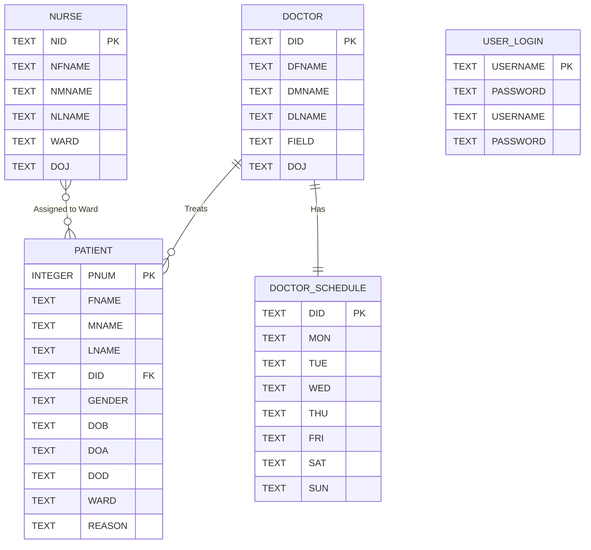

# Hospital Management System (HMS)

A full-stack Hospital Management System built using Streamlit and SQLite. It provides a complete solution for managing patients, doctors, and nurses with authentication, CRUD operations, and scheduling features. 
---

## Features

### User Authentication
- User Registration
- Login and Logout system
- Password reset (Forgot Password)
- Session-based access control using Streamlit session state

---

### Patient Management
- Add new patients with auto-generated ID
- View all patients in table format
- Search patients by Patient ID or Name
- Modify patient details:
  - Name
  - Doctor assignment
  - Gender
  - DOB / DOA / DOD
  - Ward
  - Reason for admission
- Doctor ID validation
- Age calculation from DOB

---

### Doctor Management
- View all doctors
- Search doctor by ID or name
- View doctor profile with:
  - Specialization
  - Date of Joining
- Weekly schedule (Mon–Sun)

---

### Nurse Management
- View all nurses
- Search nurse by ID or name
- Filter nurses by ward
- View nurse details:
  - Ward
  - Date of Joining

---

## Database (SQLite)

- Database file: `hms.db`
- Auto-created on first run
- Preloaded sample data included

Tables:
- usr_pwd
- Patient
- doc
- nurse
- dtime

---

## Tech Stack

- Streamlit (Frontend + UI)
- Python (Backend logic)
- SQLite3 (Database)

Libraries:
- streamlit
- sqlite3
- datetime

---

# Database Schema

## Patient Table

| Column Name | Data Type | Constraints | Description |
|-------------|-----------|-------------|-------------|
| `PNUM` | INTEGER | PRIMARY KEY | Unique Patient ID |
| `FNAME` | TEXT | NOT NULL | Patient First Name |
| `MNAME` | TEXT | Nullable | Patient Middle Name |
| `LNAME` | TEXT | NOT NULL | Patient Last Name |
| `DID` | TEXT | NOT NULL | Assigned Doctor ID |
| `GENDER` | TEXT | NOT NULL | Gender (M/F/O) |
| `DOB` | TEXT | NOT NULL | Date of Birth (YYYY-MM-DD) |
| `DOA` | TEXT | NOT NULL | Date of Admission |
| `DOD` | TEXT | Nullable | Date of Discharge |
| `WARD` | TEXT | NOT NULL | Ward Number |
| `REASON` | TEXT | NOT NULL | Reason for Admission |

---

## Doctor Table (`doc`)

| Column Name | Data Type | Constraints | Description |
|-------------|-----------|-------------|-------------|
| `DID` | TEXT | PRIMARY KEY | Doctor ID |
| `DFNAME` | TEXT | NOT NULL | Doctor First Name |
| `DMNAME` | TEXT | Nullable | Doctor Middle Name |
| `DLNAME` | TEXT | NOT NULL | Doctor Last Name |
| `FIELD` | TEXT | NOT NULL | Medical Specialization |
| `DOJ` | TEXT | NOT NULL | Date of Joining |

---

## Nurse Table

| Column Name | Data Type | Constraints | Description |
|-------------|-----------|-------------|-------------|
| `NID` | TEXT | PRIMARY KEY | Nurse ID |
| `NFNAME` | TEXT | NOT NULL | Nurse First Name |
| `NMNAME` | TEXT | Nullable | Nurse Middle Name |
| `NLNAME` | TEXT | NOT NULL | Nurse Last Name |
| `WARD` | TEXT | NOT NULL | Assigned Ward |
| `DOJ` | TEXT | NOT NULL | Date of Joining |

---

## Doctor Schedule Table (`dtime`)

| Column Name | Data Type | Constraints | Description |
|-------------|-----------|-------------|-------------|
| `DID` | TEXT | PRIMARY KEY | Doctor ID |
| `MON` | TEXT | Nullable | Monday Schedule |
| `TUE` | TEXT | Nullable | Tuesday Schedule |
| `WED` | TEXT | Nullable | Wednesday Schedule |
| `THU` | TEXT | Nullable | Thursday Schedule |
| `FRI` | TEXT | Nullable | Friday Schedule |
| `SAT` | TEXT | Nullable | Saturday Schedule |
| `SUN` | TEXT | Nullable | Sunday Schedule |

---

## User Credentials Table (`usr_pwd`)

| Column Name | Data Type | Constraints | Description |
|-------------|-----------|-------------|-------------|
| `USERNAME` | TEXT | PRIMARY KEY | Login Username |
| `PASSWORD` | TEXT | NOT NULL | User Password |

---

# Entity Relationships

| Parent Table | Child Table | Relationship |
|--------------|-------------|--------------|
| `doc` | `Patient` | One doctor can be assigned to multiple patients through `DID`. |
| `doc` | `dtime` | One doctor has one weekly schedule through `DID`. |
| `nurse` | `Patient` | Nurses are associated with patients through the assigned `WARD`. |
| `usr_pwd` | Application | Stores user login credentials for authentication. |

# Entity Relationship (ER) Diagram

```mermaid
erDiagram

    PATIENT {
        INTEGER PNUM PK
        TEXT FNAME
        TEXT MNAME
        TEXT LNAME
        TEXT DID FK
        TEXT GENDER
        TEXT DOB
        TEXT DOA
        TEXT DOD
        TEXT WARD
        TEXT REASON
    }

    DOCTOR {
        TEXT DID PK
        TEXT DFNAME
        TEXT DMNAME
        TEXT DLNAME
        TEXT FIELD
        TEXT DOJ
    }

    NURSE {
        TEXT NID PK
        TEXT NFNAME
        TEXT NMNAME
        TEXT NLNAME
        TEXT WARD
        TEXT DOJ
    }

    DOCTOR_SCHEDULE {
        TEXT DID PK
        TEXT MON
        TEXT TUE
        TEXT WED
        TEXT THU
        TEXT FRI
        TEXT SAT
        TEXT SUN
    }

    USER_LOGIN {
        TEXT USERNAME PK
        TEXT PASSWORD
    }

    DOCTOR ||--o{ PATIENT : "Treats"

    DOCTOR ||--|| DOCTOR_SCHEDULE : "Has"

    NURSE }o--o{ PATIENT : "Assigned to Ward"

    USER_LOGIN {
        TEXT USERNAME
        TEXT PASSWORD
    }
```

---

## Default Behavior

- Database is created automatically on first run
- Sample data is inserted if database is empty
- No default admin account, user must register

---

## Key Highlights

- Fully interactive Streamlit web application
- Secure SQL queries using parameterized inputs
- Modular architecture:
  - UserAuth
  - PatientOps
  - DoctorOps
  - NurseOps
- Strong input validation
- Clean tabular data presentation

---

## Author

Soumyadeep Basu

---
